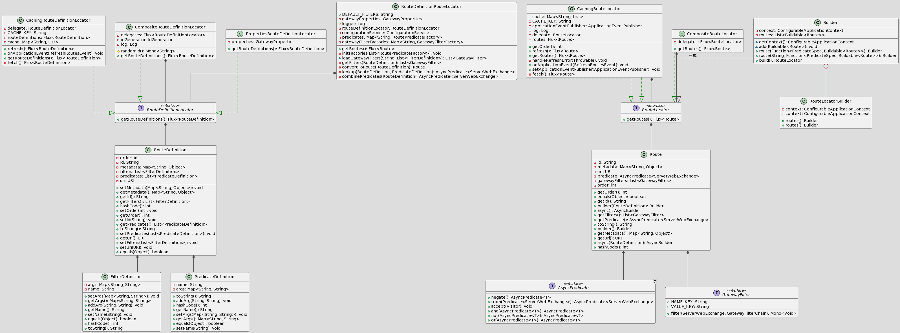
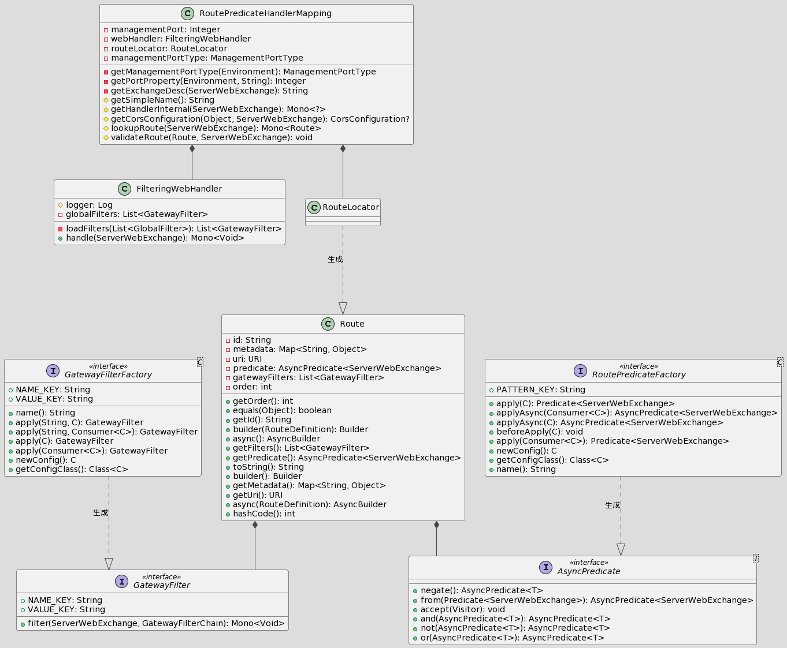

# 说明

Author: [haitaoss](https://github.com/haitaoss)

源码阅读仓库: [spring-cloud-gateway](https://github.com/haitaoss/spring-cloud-gateway)

参考资料和需要掌握的知识：

- [Spring WebFlux 源码分析](https://github.com/haitaoss/spring-framework/blob/source-v5.3.10/note/springwebflux-source-note.md)
- [Spring Cloud Gateway 官网文档](https://docs.spring.io/spring-cloud-gateway/docs/3.1.5/reference/html/)

# Spring Cloud Gateway 介绍

功能：**接收请求**并根据匹配的**路由**进行**转发**。

术语：

- **Route**: 是路由规则的描述。它由 ID、目标 URI、**Predicate集合**和**Filter集合**组成。如果 Predicate 为真，则路由匹配。
- **Predicate**: 这是一个 Java 8 函数接口。输入类型是 `ServerWebExchange` ，所以可以匹配 HTTP 请求中的任何内容，例如 Header 或参数。
- **Filter**: 这些是使用**特定工厂**构建的 `GatewayFilter` 的实例。使用这个可以在发送下游请求之前或之后修改请求和响应。

Spring Cloud Gateway 是基于 Spring WebFlux 实现的，是通过注册 WebFlux 的生命周期组件实现控制请求执行。

```properties
# Spring WebFlux 处理请求的生命周期
客户端请求 -> WebFlux服务 -> WebFilter -> HandlerMapping -> HandlerAdapter -> 执行Handler方法
```

Gateway 通过注册 [RoutePredicateHandlerMapping](#RoutePredicateHandlerMapping) 实现核心逻辑

# Gateway 自动装配

`spring-cloud-gateway-server.jar!META-INF/spring.factories`的部分内容

```properties
org.springframework.boot.autoconfigure.EnableAutoConfiguration=\
    org.springframework.cloud.gateway.config.GatewayClassPathWarningAutoConfiguration,\
    org.springframework.cloud.gateway.config.GatewayAutoConfiguration,\
    org.springframework.cloud.gateway.config.GatewayResilience4JCircuitBreakerAutoConfiguration,\
    org.springframework.cloud.gateway.config.GatewayNoLoadBalancerClientAutoConfiguration,\
    org.springframework.cloud.gateway.config.GatewayMetricsAutoConfiguration,\
    org.springframework.cloud.gateway.config.GatewayRedisAutoConfiguration,\
    org.springframework.cloud.gateway.discovery.GatewayDiscoveryClientAutoConfiguration,\
    org.springframework.cloud.gateway.config.SimpleUrlHandlerMappingGlobalCorsAutoConfiguration,\
    org.springframework.cloud.gateway.config.GatewayReactiveLoadBalancerClientAutoConfiguration,\
    org.springframework.cloud.gateway.config.GatewayReactiveOAuth2AutoConfiguration
```

`spring-cloud-gateway-webflux.jar!META-INF/spring.factories`的内容

```properties
org.springframework.boot.autoconfigure.EnableAutoConfiguration=\
org.springframework.cloud.gateway.webflux.config.ProxyResponseAutoConfiguration

org.springframework.boot.test.autoconfigure.web.reactive.AutoConfigureWebFlux=\
org.springframework.cloud.gateway.webflux.config.ProxyResponseAutoConfiguration
```

`spring-cloud-gateway-mvc.jar!META-INF/spring.factories`的内容

```properties
org.springframework.boot.autoconfigure.EnableAutoConfiguration=\
org.springframework.cloud.gateway.mvc.config.ProxyResponseAutoConfiguration

org.springframework.boot.test.autoconfigure.web.servlet.AutoConfigureWebMvc=\
org.springframework.cloud.gateway.mvc.config.ProxyResponseAutoConfiguration
```

## GatewayClassPathWarningAutoConfiguration

作用：检验启动环境不能是 SpringMVC

```java
@Configuration(proxyBeanMethods = false)
@ConditionalOnProperty(name = "spring.cloud.gateway.enabled", matchIfMissing = true)
public class GatewayClassPathWarningAutoConfiguration {

	@Configuration(proxyBeanMethods = false)
    // SpringMVC 会存在这个类，所以条件会满足，这个类就会注册到BeanFactory中
	@ConditionalOnClass(name = "org.springframework.web.servlet.DispatcherServlet")
	@ConditionalOnWebApplication(type = ConditionalOnWebApplication.Type.SERVLET)
	protected static class SpringMvcFoundOnClasspathConfiguration {

		public SpringMvcFoundOnClasspathConfiguration() {
             // 实例化就直接抛出异常
			throw new MvcFoundOnClasspathException();
		}

	}
}
```

## GatewayAutoConfiguration

### 类图

> RouteLocator 是为了得到`Flux<Route>`，可以使用 RouteLocatorBuilder 很方便的生成 RouteLocator。
>
> RouteDefinitionRouteLocator 是会根据 RouteDefinition 生成 Route ，而  RouteDefinition 是由RouteDefinitionLocator 生成的。
>
> Route 是由 AsyncPredicate 和 GatewayFilter 组成的。而 AsyncPredicate  由 RoutePredicateFactory 生成，GatewayF 创建ilter  由 GatewayFilterFactory



> RoutePredicateHandlerMapping 通过 RouteLocator 得到的 `Flux<Route>` ，遍历执行`Route.getPredicate().apply(ServerWebExchange)` 返回`true`说明命中了路由规则，将命中的 Route 存到 ServerWebExchange 中，然后执行 FilteringWebHandler 。
>
> FilteringWebHandler 的逻辑就是执行 GlobalFilter + GatewayFilter



### 源码

可以自定义这些类型的bean实现功能的扩展：**RouteLocator**、**HttpHeaderFilter**、**GlobalFilter** 、**GatewayFilterFactory**、**RoutePredicateFactory** 

```java
@Configuration(proxyBeanMethods = false)
@ConditionalOnProperty(name = "spring.cloud.gateway.enabled", matchIfMissing = true)
@ConditionalOnClass(DispatcherHandler.class)
public class GatewayAutoConfiguration {

	/**
	 * 是工具类，可用来构造出 RouteLocator 实例。若想使用编码的方式配置 Route，推荐使用这个 RouteLocatorBuilder。
	 */
	@Bean
	public RouteLocatorBuilder routeLocatorBuilder(ConfigurableApplicationContext context) {
		return new RouteLocatorBuilder(context);
	}

	/**
	 * 实现 RouteDefinitionLocator 接口，其特点是根据 GatewayProperties(配置文件中定义的route) 的内容返回 List<RouteDefinition>
	 */
	@Bean
	@ConditionalOnMissingBean
	public PropertiesRouteDefinitionLocator propertiesRouteDefinitionLocator(GatewayProperties properties) {
		return new PropertiesRouteDefinitionLocator(properties);
	}

	/**
	 * 实现 RouteDefinitionRepository 接口，定义如何 save、delete RouteDefinition
	 * 实现 RouteDefinitionLocator 接口，其特点是从缓存(Map、Redis等等)中得到 List<RouteDefinition>
	 */
	@Bean
	@ConditionalOnMissingBean(RouteDefinitionRepository.class)
	public InMemoryRouteDefinitionRepository inMemoryRouteDefinitionRepository() {
		return new InMemoryRouteDefinitionRepository();
	}
	
    /**
	 * 聚合所有的 RouteDefinitionLocator
	 */
	@Bean
	@Primary
	public RouteDefinitionLocator routeDefinitionLocator(List<RouteDefinitionLocator> routeDefinitionLocators) {
		return new CompositeRouteDefinitionLocator(Flux.fromIterable(routeDefinitionLocators));
	}

	/**
	 * 是一个工具类，可用来 实例化类、属性绑定和属性校验(JSR303)
	 * GatewayFilterFactory、RoutePredicateFactory 会使用 ConfigurationService 生成 Config 实例，并完成属性绑定和属性校验(JSR303)
	 */
	@Bean
	public ConfigurationService gatewayConfigurationService(BeanFactory beanFactory,
			@Qualifier("webFluxConversionService") ObjectProvider<ConversionService> conversionService,
			ObjectProvider<Validator> validator) {
		return new ConfigurationService(beanFactory, conversionService, validator);
	}

	/**
	 * RouteLocator 接口是用来生成 Flux<Route> 的。
	 *
	 * 依赖 RouteDefinitionLocator 得到 RouteDefinition , 而 RouteDefinition 中定义了 FilterDefinition、PredicateDefinition，
	 * 会使用 GatewayFilterFactory、RoutePredicateFactory 生成 GatewayFilter、Predicate ，然后配置给 Route 实例
	 * 而 GatewayFilterFactory、RoutePredicateFactory 继承这两个接口 ShortcutConfigurable、Configurable，这两个接口是为了得到 Config 。
	 * 会使用 ConfigurationService 生成 Config 实例，并完成属性绑定和属性校验(JSR303)。
	 * GatewayFilterFactory、RoutePredicateFactory 会根据 Config 来生成 GatewayFilter、Predicate
	 */
	@Bean
	public RouteLocator routeDefinitionRouteLocator(GatewayProperties properties,
			List<GatewayFilterFactory> gatewayFilters, List<RoutePredicateFactory> predicates,
			RouteDefinitionLocator routeDefinitionLocator, ConfigurationService configurationService) {
		return new RouteDefinitionRouteLocator(routeDefinitionLocator, predicates, gatewayFilters, properties,
				configurationService);
	}

	/**
	 * 聚合所有的 RouteLocator 。所以我们可以自定义 RouteLocator 自定义路由
	 */
	@Bean
	@Primary
	@ConditionalOnMissingBean(name = "cachedCompositeRouteLocator")
	// TODO: property to disable composite?
	public RouteLocator cachedCompositeRouteLocator(List<RouteLocator> routeLocators) {
		return new CachingRouteLocator(new CompositeRouteLocator(Flux.fromIterable(routeLocators)));
	}

	/**
	 * 实现 ApplicationListener<ApplicationEvent> 接口，
	 * 收到关心的事件(ContextRefreshedEvent、RefreshScopeRefreshedEvent、InstanceRegisteredEvent、ParentHeartbeatEvent、HeartbeatEvent)
	 * 就会 发布一个 RefreshRoutesEvent 事件
	 */
	@Bean
	@ConditionalOnClass(name = "org.springframework.cloud.client.discovery.event.HeartbeatMonitor")
	public RouteRefreshListener routeRefreshListener(ApplicationEventPublisher publisher) {
		return new RouteRefreshListener(publisher);
	}

	/**
	 * FilteringWebHandler 实现 WebHandler 接口，可以理解成 SpringMVC 中的 handler，
	 * RoutePredicateHandlerMapping.getHandler() 返回的就是 FilteringWebHandler，
	 * FilteringWebHandler 就是遍历执行 GlobalFilter + Route配置的WebFilter
	 */
	@Bean
	public FilteringWebHandler filteringWebHandler(List<GlobalFilter> globalFilters) {
		return new FilteringWebHandler(globalFilters);
	}

	/**
	 * RoutePredicateHandlerMapping 实现 HandlerMapping 接口。
	 *
	 * RoutePredicateHandlerMapping#getHandler 是根据 RouteLocator 得到的 List<Route> 遍历执行 Route.getPredicate().apply(ServerWebExchange)
	 * 为 true 就说明匹配，会返回 FilteringWebHandler
	 */
	@Bean
	@ConditionalOnMissingBean
	public RoutePredicateHandlerMapping routePredicateHandlerMapping(FilteringWebHandler webHandler,
			RouteLocator routeLocator, GlobalCorsProperties globalCorsProperties, Environment environment) {
		return new RoutePredicateHandlerMapping(webHandler, routeLocator, globalCorsProperties, environment);
	}
    
  // HttpHeaderFilter beans ...
	// GlobalFilter beans	...
	// Predicate Factory beans	...
	// GatewayFilter Factory beans	...
  // GatewayActuatorConfiguration 会注册 Endpoint 用于查看、新增、更新、删除 RouteDefinition 
}
```

## GatewayResilience4JCircuitBreakerAutoConfiguration

```java
@Configuration(proxyBeanMethods = false)
@ConditionalOnProperty(name = "spring.cloud.gateway.enabled", matchIfMissing = true)
@ConditionalOnClass({ DispatcherHandler.class, ReactiveResilience4JAutoConfiguration.class,
      ReactiveCircuitBreakerFactory.class, ReactiveResilience4JCircuitBreakerFactory.class })
public class GatewayResilience4JCircuitBreakerAutoConfiguration {

   /**
    * SpringCloudCircuitBreakerResilience4JFilterFactory 实现 GatewayFilterFactory 接口，
    * 其核心逻辑是使用 ReactiveCircuitBreaker 来执行业务逻辑，当 出现异常 或者 路由请求返回的状态码是期望值 就
    * 使用 dispatcherHandler 来执行 fallbackUrl，并且会往 ServerWebExchange 设置一个key记录异常对象。 
    *
    */
   @Bean
   @ConditionalOnBean(ReactiveResilience4JCircuitBreakerFactory.class)
   @ConditionalOnEnabledFilter
   public SpringCloudCircuitBreakerResilience4JFilterFactory springCloudCircuitBreakerResilience4JFilterFactory(
         ReactiveResilience4JCircuitBreakerFactory reactiveCircuitBreakerFactory,
         ObjectProvider<DispatcherHandler> dispatcherHandler) {
      return new SpringCloudCircuitBreakerResilience4JFilterFactory(reactiveCircuitBreakerFactory, dispatcherHandler);
   }

   /**
    * FallbackHeadersGatewayFilterFactory 实现 GatewayFilterFactory 接口，
    * 其核心逻辑：如果请求是 fallbackUrl 执行的（通过异常key判断），那就设置一些请求头
    */
   @Bean
   @ConditionalOnMissingBean
   @ConditionalOnEnabledFilter
   public FallbackHeadersGatewayFilterFactory fallbackHeadersGatewayFilterFactory() {
      return new FallbackHeadersGatewayFilterFactory();
   }

}
```

## GatewayNoLoadBalancerClientAutoConfiguration

```java
@Configuration(proxyBeanMethods = false)
@ConditionalOnMissingClass("org.springframework.cloud.loadbalancer.core.ReactorLoadBalancer")
@ConditionalOnMissingBean(ReactiveLoadBalancer.class)
@EnableConfigurationProperties(GatewayLoadBalancerProperties.class)
@AutoConfigureAfter(GatewayReactiveLoadBalancerClientAutoConfiguration.class)
public class GatewayNoLoadBalancerClientAutoConfiguration {

   /** 
    * NoLoadBalancerClientFilter 实现 GlobalFilter 接口，也就是每个 Route 的请求都会执行。
    * 功能：路由的Url 有 lb 前缀 就直接抛出异常，也就是说不支持 负载均衡的路由
    * 
    * BeanFactory 中没有 ReactiveLoadBalancerClientFilter 才会生效。
    */
   @Bean
   @ConditionalOnMissingBean(ReactiveLoadBalancerClientFilter.class)
   public NoLoadBalancerClientFilter noLoadBalancerClientFilter(GatewayLoadBalancerProperties properties) {
      return new NoLoadBalancerClientFilter(properties.isUse404());
   }

   protected static class NoLoadBalancerClientFilter implements GlobalFilter, Ordered {

      private final boolean use404;

      public NoLoadBalancerClientFilter(boolean use404) {
         this.use404 = use404;
      }

      @Override
      public int getOrder() {
         return LOAD_BALANCER_CLIENT_FILTER_ORDER;
      }

      @Override
      @SuppressWarnings("Duplicates")
      public Mono<Void> filter(ServerWebExchange exchange, GatewayFilterChain chain) {
         URI url = exchange.getAttribute(GATEWAY_REQUEST_URL_ATTR);
         String schemePrefix = exchange.getAttribute(GATEWAY_SCHEME_PREFIX_ATTR);
         // url 没有 lb 前缀 就放行
         if (url == null || (!"lb".equals(url.getScheme()) && !"lb".equals(schemePrefix))) {
            return chain.filter(exchange);
         }
         // 不能处理 lb:// 所以 直接报错
         throw NotFoundException.create(use404, "Unable to find instance for " + url.getHost());
      }

   }

}
```

## GatewayMetricsAutoConfiguration

```java
@Configuration(proxyBeanMethods = false)
@ConditionalOnProperty(name = GatewayProperties.PREFIX + ".enabled", matchIfMissing = true)
@EnableConfigurationProperties(GatewayMetricsProperties.class)
@ConditionalOnClass({ DispatcherHandler.class, MeterRegistry.class, MetricsAutoConfiguration.class })
public class GatewayMetricsAutoConfiguration {

   // 会从 ServerWebExchange 中得到 请求的Method、响应的状态码等
   @Bean
   public GatewayHttpTagsProvider gatewayHttpTagsProvider() {
      return new GatewayHttpTagsProvider();
   }

   // 会从 ServerWebExchange 中得到 匹配的路由地址
   @Bean
   @ConditionalOnProperty(name = GatewayProperties.PREFIX + ".metrics.tags.path.enabled")
   public GatewayPathTagsProvider gatewayPathTagsProvider() {
      return new GatewayPathTagsProvider();
   }

   // 会从 ServerWebExchange 中得到 routId、route uri
   @Bean
   public GatewayRouteTagsProvider gatewayRouteTagsProvider() {
      return new GatewayRouteTagsProvider();
   }

   // 将 GatewayMetricsProperties 的信息映射成 Tags
   @Bean
   public PropertiesTagsProvider propertiesTagsProvider(GatewayMetricsProperties properties) {
      return new PropertiesTagsProvider(properties.getTags());
   }

   /**
    * GatewayMetricsFilter 实现 GlobalFilter 接口，
    * 将 List<GatewayTagsProvider> 返回的信息记录到 MeterRegistry 中
    */
   @Bean
   @ConditionalOnBean(MeterRegistry.class)
   @ConditionalOnProperty(name = GatewayProperties.PREFIX + ".metrics.enabled", matchIfMissing = true)
   public GatewayMetricsFilter gatewayMetricFilter(MeterRegistry meterRegistry,
         List<GatewayTagsProvider> tagsProviders, GatewayMetricsProperties properties) {
      return new GatewayMetricsFilter(meterRegistry, tagsProviders, properties.getPrefix());
   }

   /**
    * RouteDefinitionMetrics 实现 ApplicationListener<RefreshRoutesEvent> 接口，
    * 收到事件的逻辑是 RouteDefinitionLocator.getRouteDefinitions().count() 记录到 MeterRegistry 中
    */
   @Bean
   @ConditionalOnBean(MeterRegistry.class)
   @ConditionalOnProperty(name = GatewayProperties.PREFIX + ".metrics.enabled", matchIfMissing = true)
   public RouteDefinitionMetrics routeDefinitionMetrics(MeterRegistry meterRegistry,
         RouteDefinitionLocator routeDefinitionLocator, GatewayMetricsProperties properties) {
      return new RouteDefinitionMetrics(meterRegistry, routeDefinitionLocator, properties.getPrefix());
   }

}
```

## GatewayRedisAutoConfiguration

```java
@Configuration(proxyBeanMethods = false)
@ConditionalOnBean(ReactiveRedisTemplate.class)
@ConditionalOnClass({ RedisTemplate.class, DispatcherHandler.class })
@ConditionalOnProperty(name = "spring.cloud.gateway.redis.enabled", matchIfMissing = true)
class GatewayRedisAutoConfiguration {
	 
   /**
    * RedisRouteDefinitionRepository 实现 RouteDefinitionRepository 接口。
    * 使用 redis 作为缓存层，存储 RouteDefinition
    */
   @Bean
   @ConditionalOnProperty(value = "spring.cloud.gateway.redis-route-definition-repository.enabled",
         havingValue = "true")
   @ConditionalOnClass(ReactiveRedisTemplate.class)
   public RedisRouteDefinitionRepository redisRouteDefinitionRepository(
         ReactiveRedisTemplate<String, RouteDefinition> reactiveRedisTemplate) {
      return new RedisRouteDefinitionRepository(reactiveRedisTemplate);
   }
  
   // ...
}
```

## GatewayDiscoveryClientAutoConfiguration

```java
@Configuration(proxyBeanMethods = false)
@ConditionalOnProperty(name = "spring.cloud.gateway.enabled", matchIfMissing = true)
@ConditionalOnClass({ DispatcherHandler.class, CompositeDiscoveryClientAutoConfiguration.class })
@EnableConfigurationProperties
public class GatewayDiscoveryClientAutoConfiguration {

	/**
	 * 这是一个 PathRoutePredicateFactory，根据 serviceId 进行路由
	 * @return
	 */
	public static List<PredicateDefinition> initPredicates() {
		ArrayList<PredicateDefinition> definitions = new ArrayList<>();
		// TODO: add a predicate that matches the url at /serviceId?

		// add a predicate that matches the url at /serviceId/**
		PredicateDefinition predicate = new PredicateDefinition();
		predicate.setName(normalizeRoutePredicateName(PathRoutePredicateFactory.class));
		predicate.addArg(PATTERN_KEY, "'/'+serviceId+'/**'");
		definitions.add(predicate);
		return definitions;
	}

	/**
	 * 这是一个 RewritePathGatewayFilterFactory，移除 serviceId 路径前缀
	 * @return
	 */
	public static List<FilterDefinition> initFilters() {
		ArrayList<FilterDefinition> definitions = new ArrayList<>();

		// add a filter that removes /serviceId by default
		FilterDefinition filter = new FilterDefinition();
		filter.setName(normalizeFilterFactoryName(RewritePathGatewayFilterFactory.class));
		String regex = "'/' + serviceId + '/?(?<remaining>.*)'";
		String replacement = "'/${remaining}'";
		filter.addArg(REGEXP_KEY, regex);
		filter.addArg(REPLACEMENT_KEY, replacement);
		definitions.add(filter);

		return definitions;
	}

	/**
	 * DiscoveryLocatorProperties 类上标注了 @ConfigurationProperties("spring.cloud.gateway.discovery.locator")
	 * 也就是可以通过配置属性的方式设置属性值，下面的逻辑是设置默认值的意思。
	 * DiscoveryClientRouteDefinitionLocator 会使用这两个属性会作为生成 RouteDefinition 的 Predicate 和 Filter
	 * @return
	 */
	@Bean
	public DiscoveryLocatorProperties discoveryLocatorProperties() {
		DiscoveryLocatorProperties properties = new DiscoveryLocatorProperties();
		// 默认就设置 PathRoutePredicateFactory
		properties.setPredicates(initPredicates());
		// 默认就设置 RewritePathGatewayFilterFactory
		properties.setFilters(initFilters());
		return properties;
	}

	@Configuration(proxyBeanMethods = false)
	@ConditionalOnProperty(value = "spring.cloud.discovery.reactive.enabled", matchIfMissing = true)
	public static class ReactiveDiscoveryClientRouteDefinitionLocatorConfiguration {

		/**
		 * DiscoveryClientRouteDefinitionLocator 实现 RouteDefinitionLocator。
		 * 会根据 ReactiveDiscoveryClient.getServices() 返回的 Flux<ServiceInstance> 生成 Flux<RouteDefinition>
		 * 每个 RouteDefinition 是由 ServiceInstance + DiscoveryLocatorProperties 的内容 配置 路由Uri、Predicate、Filter
		 * 大部分属性值是通过解析 SPEL 表达式得到的，其中根对象是 ServiceInstance，所以说 编写的 SPEL 表达式可以引用 ServiceInstance 中的属性
		 *
		 * @param discoveryClient
		 * @param properties
		 * @return
		 */
		@Bean
		@ConditionalOnProperty(name = "spring.cloud.gateway.discovery.locator.enabled")
		public DiscoveryClientRouteDefinitionLocator discoveryClientRouteDefinitionLocator(
				ReactiveDiscoveryClient discoveryClient, DiscoveryLocatorProperties properties) {
			return new DiscoveryClientRouteDefinitionLocator(discoveryClient, properties);
		}

	}

}
```

## SimpleUrlHandlerMappingGlobalCorsAutoConfiguration

```java
@Configuration(proxyBeanMethods = false)
@ConditionalOnClass(SimpleUrlHandlerMapping.class)
@ConditionalOnProperty(name = "spring.cloud.gateway.globalcors.add-to-simple-url-handler-mapping",
      matchIfMissing = false)
public class SimpleUrlHandlerMappingGlobalCorsAutoConfiguration {

   @Autowired
   private GlobalCorsProperties globalCorsProperties;

   @Autowired
   private SimpleUrlHandlerMapping simpleUrlHandlerMapping;

   /**
    * 为 SimpleUrlHandlerMapping 配置 跨域配置信息
    */
   @PostConstruct
   void config() {
      simpleUrlHandlerMapping.setCorsConfigurations(globalCorsProperties.getCorsConfigurations());
   }

}
```

## GatewayReactiveLoadBalancerClientAutoConfiguration

```java
@Configuration(proxyBeanMethods = false)
@ConditionalOnClass({ ReactiveLoadBalancer.class, LoadBalancerAutoConfiguration.class, DispatcherHandler.class })
@EnableConfigurationProperties(GatewayLoadBalancerProperties.class)
public class GatewayReactiveLoadBalancerClientAutoConfiguration {

   /**
    * ReactiveLoadBalancerClientFilter 实现 GlobalFilter 接口。
    * 作用：url 没有 lb 协议 就放行，有 lb 就使用 LoadBalancerClientFactory 得到负载均衡后的 uri，修改 ServerWebExchange 放行filter
    */
   @Bean
   @ConditionalOnBean(LoadBalancerClientFactory.class)
   @ConditionalOnMissingBean(ReactiveLoadBalancerClientFilter.class)
   @ConditionalOnEnabledGlobalFilter
   public ReactiveLoadBalancerClientFilter gatewayLoadBalancerClientFilter(LoadBalancerClientFactory clientFactory,
         GatewayLoadBalancerProperties properties) {
      return new ReactiveLoadBalancerClientFilter(clientFactory, properties);
   }

   /**
    * LoadBalancerServiceInstanceCookieFilter 实现 GlobalFilter 接口
    * 作用：是负载均衡的路由，就添加一个Cookie键值对
    */
   @Bean
   @ConditionalOnBean({ ReactiveLoadBalancerClientFilter.class, LoadBalancerClientFactory.class })
   @ConditionalOnMissingBean
   @ConditionalOnEnabledGlobalFilter
   public LoadBalancerServiceInstanceCookieFilter loadBalancerServiceInstanceCookieFilter(
         LoadBalancerClientFactory loadBalancerClientFactory) {
      return new LoadBalancerServiceInstanceCookieFilter(loadBalancerClientFactory);
   }

}
```

## GatewayReactiveOAuth2AutoConfiguration

这是 Spring Security 的组件，没研究过，不知道具体的作用是啥，暂时不管了。

## ProxyResponseAutoConfiguration

ProxyResponseAutoConfiguration 是 HandlerMethodArgumentResolver 接口的实现类，是用来解析方法参数的。它支持解析 `ProxyExchange` 类型的参数。`ProxyExchange` 可用来执行Http请求，感觉好鸡肋...

又因为 SpringWebFlux 和 SpringMVC 的执行流程是类似的，定义的类名也是一样的(包不同)，所以就搞了两套。

注：HandlerMethodArgumentResolver 是 SpringMVC 、SpringWebFlux 的内容，不细说了。

# 核心源码

# Gateway处理请求流程

# 定义的 Endpoint


| ID              | HTTP Method | Description                                                  |
| :-------------- | :---------- | :----------------------------------------------------------- |
| `globalfilters` | GET         | Displays the list of global filters applied to the routes. 显示应用于路由的全局过滤器列表。 |
| `routefilters`  | GET         | Displays the list of `GatewayFilter` factories applied to a particular route. 显示应用于特定路由的 `GatewayFilter` 工厂列表。 |
| `refresh`       | POST        | Clears the routes cache. 清除路由缓存。                      |
| `routes`        | GET         | Displays the list of routes defined in the gateway. 显示网关中定义的路由列表。 |
| `routes/{id}`   | GET         | Displays information about a particular route. 显示有关特定路线的信息。 |
| `routes/{id}`   | POST        | Adds a new route to the gateway. 添加到网关的新路由。        |
| `routes/{id}`   | DELETE      | Removes an existing route from the gateway. 从网关中删除现有路由。 |